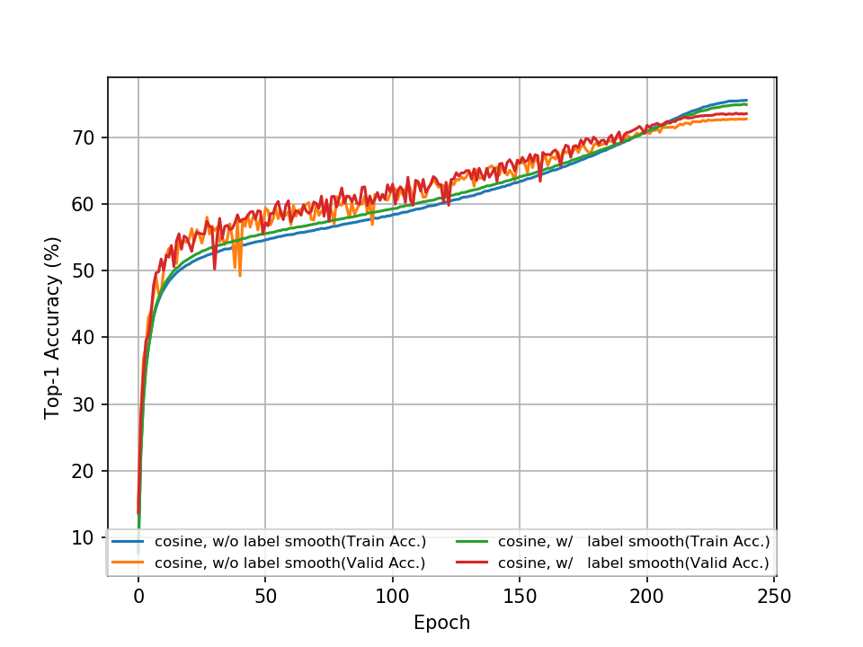

# PyTorch Implementation of GhostNet
Reproduction of GhostNet architecture as described in [GhostNet: More Features from Cheap Operations](https://arxiv.org/abs/1911.11907) by Kai Han, Yunhe Wang, Qi Tian, Jianyuan Guo, Chunjing Xu, Chang Xu on ILSVRC2012 benchmark with [PyTorch](pytorch.org) framework.

# Pretrained Models
| Architecture      | # Parameters | MFLOPs | Top-1 / Top-5 Accuracy (%) |
| ----------------- | ------------ | ------ | -------------------------- |
| [GhostNet 1.0x](https://github.com/d-li14/ghostnet.pytorch/blob/master/pretrained/ghostnet_1x-f97d70db.pth) | 5.181M | 140.77 | 73.636 / 91.228 |

```python
from ghostnet import ghostnet

net = ghostnet()
net.load_state_dict(torch.load('pretrained/ghostnet_1x-9c40f966.pth'))
```

# Training Strategy
* *batch size* 1024 on 8 GPUs
* *Initial learning rate* 0.4
* *weight decay* 0.00004
* *dropout rate* 0.2
* **no** weight decay on BN

We keep the above settings as the same and conduct experiments with different training techniques below for ablation and reproduction. During the warmup phase, learning rate linearly ramps up from 0.1 to 0.4.

| epoch | LR annealing | warmup | label smooth | Top-1 / Top-5 Accuracy (%) |
| :---: | :----------: | :----: | :----------: | :------------------------: |
| 240 | linear | × | × | 72.318 / 90.670 |
| 360 | linear | × | × | 72.458 / 90.780 |
| 240 | cosine | √ | × | 72.772 / 90.902 |
| 240 | cosine | √ | √ | 73.636 / 91.228 |



# Citation
```
@inproceedings{Han_2020_CVPR,
  title={GhostNet: More Features from Cheap Operations},
  author={Han, Kai and Wang, Yunhe and Tian, Qi and Guo, Jianyuan and Xu, Chunjing and Xu, Chang},
  booktitle = {The IEEE Conference on Computer Vision and Pattern Recognition (CVPR)},
  month = {June},
  year={2020}
}
```
